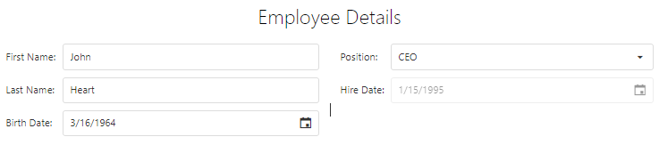

<!-- default badges list -->

<!-- default badges end -->

# DevExtreme Form - How to change certain Form items based on a value of another item

This example demonstrates how to show/hide or enable/disable form items based on a value of another item. 

The main idea is to change the [visible](https://js.devexpress.com/Documentation/ApiReference/UI_Widgets/dxForm/Item_Types/SimpleItem/#visible) option of a certain form item in the [onFieldDataChanged](https://js.devexpress.com/Documentation/ApiReference/UI_Widgets/dxForm/Configuration/#onFieldDataChanged) form's event handler. The same approach can be used with the [disabled](https://js.devexpress.com/Documentation/ApiReference/UI_Widgets/dxTextBox/Configuration/#disabled) option of the required form item editor. We can do that using [editorOptions](https://js.devexpress.com/Documentation/ApiReference/UI_Widgets/dxForm/Item_Types/SimpleItem/#editorOptions). 

In our particular case, we hide the **Address** form item and disable the **Hire Date** item editor when the **Position** form item value is set to "CEO". 

## Files to Review

- **Angular**
    - [app.component.html](angular/src/app/app.component.html)
    - [app.component.ts](angular/src/app/app.component.ts)
- **jQuery**
    - [index.js](jquery/src/index.js)
- **React**
    - [App.js](react/src/App.jsx)
- **Vue**
    - [App.vue](vue/src/App.vue)

## Documentation

- [Getting Started with Form](https://js.devexpress.com/Documentation/Guide/UI_Components/Scheduler/Getting_Started_with_Form/)

- [Form - API Reference](https://js.devexpress.com/Documentation/ApiReference/UI_Components/dxForm/)
