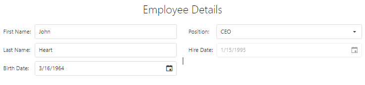

<!-- default badges list -->

<!-- default badges end -->
# Form for DevExtreme - How to change certain Form items based on a value of another item

This example demonstrates how to show/hide or enable/disable form items based on a value of another item.

The main idea is to change the [visible](https://js.devexpress.com/Documentation/ApiReference/UI_Components/dxForm/Item_Types/SimpleItem/#visible) option of a certain form item when the value of another item changes (use the [onFieldDataChanged](https://js.devexpress.com/Documentation/ApiReference/UI_Components/dxForm/Configuration/#onFieldDataChanged) event to detect the change). The same approach can be used with the [disabled](https://js.devexpress.com/Documentation/ApiReference/UI_Components/dxTextBox/Configuration/#disabled) option of the required form item editor. We can do that using [editorOptions](https://js.devexpress.com/Documentation/ApiReference/UI_Components/dxForm/Item_Types/SimpleItem/#editorOptions).

In our particular case, we hide the **Address** form item and disable the **Hire Date** item editor when the **Position** form item value is set to "CEO".

## Files to Review

- **Angular**
    - [app.component.html](Angular/src/app/app.component.html)
    - [app.component.ts](Angular/src/app/app.component.ts)
- **React**
    - [App.tsx](React/src/App.tsx)
- **Vue**
    - [HomeContent.vue](Vue/src/components/HomeContent.vue)
- **jQuery**
    - [index.html](jQuery/src/index.html)
    - [index.js](jQuery/src/index.js)
- **ASP.NET Core**
    - [Index.cshtml](ASP.NET%20Core/Views/Home/Index.cshtml)

## Documentation

- [Getting Started with Form](https://js.devexpress.com/Documentation/Guide/UI_Components/Form/Getting_Started_with_Form/)

- [Form - API Reference](https://js.devexpress.com/Documentation/ApiReference/UI_Components/dxForm/)
<!-- feedback -->
## Does This Example Address Your Development Requirements/Objectives?

 

(you will be redirected to DevExpress.com to submit your response)
<!-- feedback end -->
